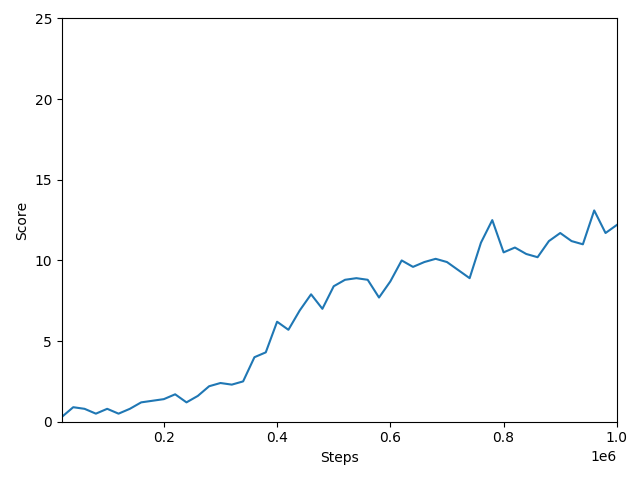
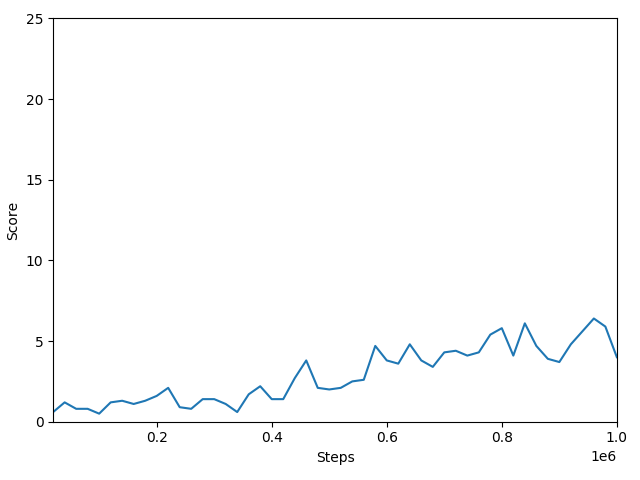
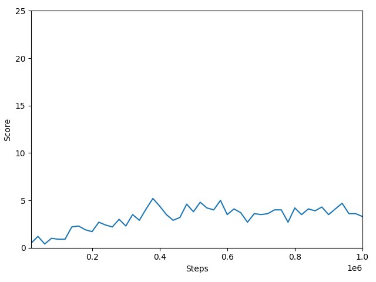

# MoveToBeacon

## Introduction
Implementation of an Artificial Intelligent Agent that learns to play
the StarCraft II minimap MoveToBeacon by itself using only raw pixels.

## Environment
In this project PySC2 is used. PySC2 is a Python-based interface for communicating with the game engine.

One important argument of the environment is step_mul. It defines the number of game steps 
per observation. With a screen size of 64 x 64 pixels and a step_mul of 
3 the player moves at a speed of about 1 pixel per observation.

## MoveToBeacon
MoveToBeacon is a map with 1 Marine and 1 Beacon. The Marine earns a reward of 1 for reaching the Beacon. If the Marine doesn't 
reach the Beacon, the Beacon disappears after 120 seconds 
(we call this time frame an episode). After one episode the environment 
is reset. For a perfect player it's possible to receive a total reward of 
about 30 after 120 seconds.

## Run
### Reinforce
```shell
$ python -m reinforce.run
```
### A2C
```shell
$ python -m a2c.run
```

### PPO
```shell
$ python -m ppo.run
```

## Results
### Reinforce


### A2C


### PPO


